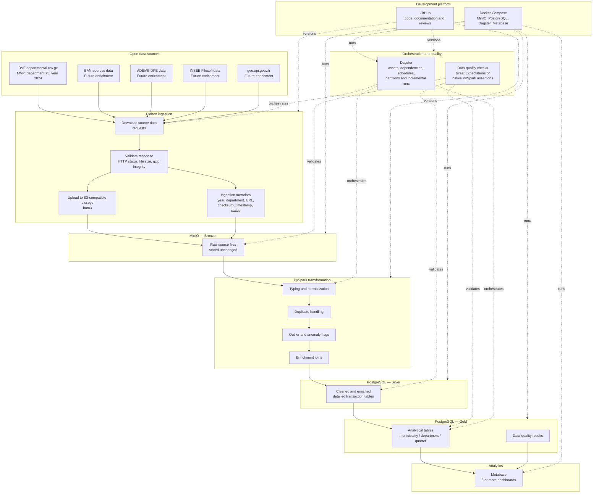

# French Real Estate ETL — Initial Architecture V0

## 1. Purpose

This document presents the initial target architecture of the French Real
Estate ETL project.

The system will ingest French property transaction data, preserve the original
source files, clean and enrich the data, create analytical tables and expose
KPIs through Metabase.

This is an initial architecture. It may evolve as the team explores the data
and implements the pipeline.

## 2. Confirmed MVP scope

The first end-to-end version of the pipeline uses:

- Department: `75`
- Year: `2024`
- Main source: Geolocated DVF departmental `csv.gz` file

The scripts must accept the year and department as parameters.

Example:

```powershell
python src/ingestion/download_dvf.py --year 2024 --department 75
```

After the Paris 2024 pipeline works end to end, the intended extension is:

- Departments: `75`, `92`, `93`, `94`
- Years: `2023`, `2024`

The extension must require configuration changes only, not a rewrite of the
pipeline.

## 3. Architecture diagram



## 4. Main data flow

The main pipeline follows these stages:

1. A Python script downloads the selected DVF departmental archive using
   `requests`.
2. The downloaded response is validated before it enters the data platform.
3. The original `csv.gz` file is uploaded unchanged to MinIO using `boto3`.
4. MinIO forms the Bronze layer and preserves the original source data.
5. PySpark reads Bronze data and applies typing, normalization, duplicate
   handling, anomaly flags and enrichment joins.
6. Cleaned and enriched detailed records are stored in PostgreSQL Silver.
7. PostgreSQL Gold tables contain analytical aggregates for municipalities,
   departments and quarters.
8. Metabase reads Gold tables and displays analytical and data-quality
   dashboards.
9. Dagster eventually orchestrates the complete pipeline.
10. Data-quality controls validate Bronze, Silver and Gold outputs.

## 5. Sprint 0 implemented path

During Sprint 0, the team is implementing only the first vertical part of the
architecture:

```text
DVF departmental csv.gz
        ↓
Python downloader using requests
        ↓
Local source validation
        ↓
MinIO connection using boto3
        ↓
MinIO Bronze raw object
```

This corresponds to the following Jira tickets:

- `RETL0-37`: development environment
- `RETL0-5`: MinIO with Docker Compose
- `RETL0-6`: parameterized DVF downloader
- `RETL0-50`: MinIO client connection
- `RETL0-55`: raw DVF upload to MinIO

The remaining layers are target components for later sprints.

## 6. Bronze storage convention

The Bronze layer stores source files unchanged.

Proposed DVF object path:

```text
dvf/year=<year>/department=<department>/<department>.csv.gz
```

MVP example:

```text
dvf/year=2024/department=75/75.csv.gz
```

When publication versioning is introduced, the path can become:

```text
dvf/publication=<publication>/year=<year>/department=<department>/<department>.csv.gz
```

## 7. Incremental-ingestion principle

The ingestion process must eventually record:

- source URL;
- source publication;
- year;
- department;
- file size;
- checksum;
- ingestion timestamp;
- processing status.

Expected behaviour:

- New file: download and process.
- Same file and same checksum: skip.
- Existing file with a changed checksum: store the new version and reprocess
  only the affected partition.

The partition parameters are:

```text
publication + year + department
```

## 8. Layer responsibilities

### Bronze

- Stores source files unchanged.
- Preserves source versions.
- Enables replay and auditing.
- Contains no cleaning or business transformation.

### Silver

- Applies explicit data types.
- Normalizes columns and codes.
- Handles duplicates.
- Flags invalid records and outliers.
- Joins DVF with enrichment sources.
- Preserves detailed transaction data.

### Gold

- Contains analytical facts and aggregates.
- Supports municipality, department and quarterly analysis.
- Provides stable KPI definitions.
- Supplies data directly to Metabase.

## 9. Technical choices

### Medallion architecture

Bronze, Silver and Gold separate source preservation, data preparation and
analytical consumption. This allows downstream layers to be rebuilt from Bronze
without downloading the source again.

### Python requests

`requests` is used to download DVF archives and access enrichment sources.

### boto3

`boto3` is used because MinIO supports the S3 protocol.

### MinIO

MinIO stores raw source files and separates data storage from transformation
processing.

### PySpark

PySpark is the transformation engine used for typing, cleaning, duplicate
handling, outlier management and joins.

PySpark is not a storage layer.

### PostgreSQL

PostgreSQL stores structured Silver and Gold tables and provides SQL access for
Metabase.

### Dagster

Dagster will manage dependencies, schedules, partitions, retries and pipeline
run metadata.

Incremental ingestion must still be implemented using parameters, checksums and
source manifests.

### Data quality

The project will use either Great Expectations or native PySpark assertions.
The final decision must be recorded separately.

### Metabase

Metabase connects to PostgreSQL and provides the required analytical
dashboards without requiring a custom frontend.

### Docker Compose

Docker Compose provides a reproducible local environment for MinIO,
PostgreSQL, Dagster and Metabase.

### GitHub

GitHub stores the source code, documentation, configuration and review history.

## 10. Open decisions

The following points may be refined in later sprints:

- Exact Silver table structure.
- Exact Gold fact and dimension tables.
- Great Expectations versus native PySpark assertions.
- DPE and BAN matching strategy.
- Final incremental-publication versioning convention.
- Final dashboard and KPI definitions.

## 11. Architecture status

This document is Architecture Version 0.

It reflects the confirmed MVP scope and the planned end-to-end pipeline. It
will be updated when implementation decisions are validated during later
sprints.