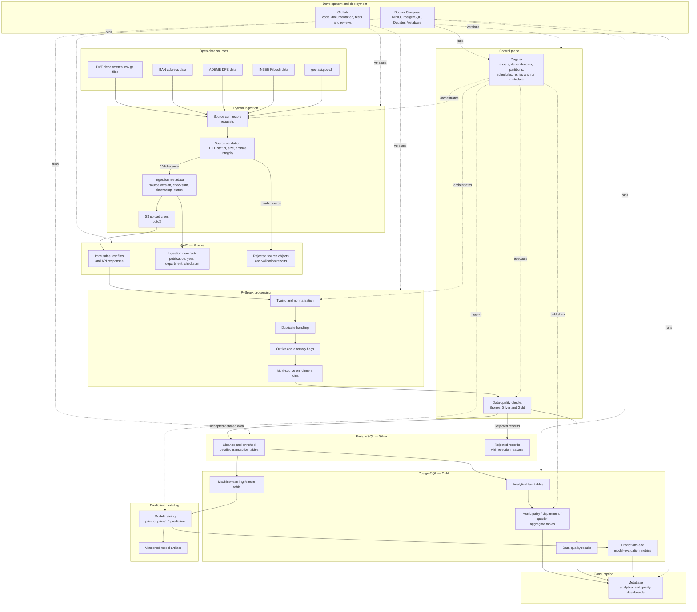

# French Real Estate ETL — Initial Architecture

## Purpose

This document presents the initial target architecture for the French real
estate ETL platform.

The platform ingests DVF property transactions and selected enrichment sources,
preserves raw data in Bronze, produces cleaned and enriched Silver data, exposes
analytical Gold tables, supports predictive modeling, and serves dashboards
through Metabase.

## Architecture diagram

## Main data flow

The principal data flow is:

1. Source files and responses are acquired by Python connectors.
2. Source validation checks the response and archive before ingestion.
3. Raw objects are uploaded unchanged into MinIO Bronze.
4. PySpark applies typing, normalization, duplicate handling, anomaly flags and
   enrichment joins.
5. Cleaned detailed records are published into PostgreSQL Silver.
6. Gold fact and aggregate tables are produced from Silver.
7. Metabase queries Gold tables to deliver dashboards and KPIs.
8. The predictive pipeline consumes a governed Gold feature table.
9. Predictions and evaluation metrics are written into Gold and exposed in
   Metabase.
10. Dagster orchestrates the complete dependency graph.

## Incremental-ingestion strategy

DVF source objects are partitioned by:

- publication version;
- transaction year;
- department.

Example Bronze object path:

`dvf/publication=2026-04/year=2024/department=75/75.csv.gz`

Each ingestion run stores:

- source URL;
- source publication;
- year;
- department;
- file size;
- SHA-256 checksum;
- ingestion timestamp;
- execution status.

The processing rules are:

- a new source partition is downloaded and processed;
- an existing object with the same checksum is skipped;
- an existing source with a changed checksum is stored as a new source version;
- only the affected downstream partitions are reprocessed.

Dagster supplies asset dependencies, partitions, schedules, retries and run
metadata. The team must still implement the checksum comparison, idempotency and
partition-selection rules.

## Layer responsibilities

### Bronze

- Preserves source files and API responses unchanged.
- Stores source versions and ingestion manifests.
- Enables replay and auditing.
- Contains no business transformations.

### Silver

- Applies explicit types.
- Standardizes field names and codes.
- Handles or flags duplicates.
- Flags outliers and invalid records.
- Enriches DVF with administrative, income, address and energy information.
- Preserves detailed transaction-level data and lineage.

### Gold

- Contains business-oriented fact and aggregate tables.
- Supports municipality, department and quarterly analysis.
- Provides stable KPI definitions to Metabase.
- Provides governed feature tables for predictive modeling.
- Stores predictions, model metrics and data-quality results.

## Technical-choice justification

### Medallion architecture

Bronze, Silver and Gold separate immutable source preservation, detailed data
preparation and business-facing analytical outputs. Bronze allows the team to
rebuild downstream layers without downloading the original source again.

### MinIO

MinIO provides S3-compatible object storage for raw compressed DVF files,
enrichment-source extracts and ingestion manifests. It separates storage from
processing and supports source versioning.

### PySpark

PySpark is used as the transformation engine for schema enforcement, cleaning,
duplicate handling, outlier flags and multi-source joins. It is not the Silver
storage system.

### PostgreSQL

PostgreSQL stores cleaned detailed Silver tables and analytical Gold tables. It
supports explicit relational schemas, SQL validation and direct Metabase
connectivity.

### Native PySpark quality checks

Native PySpark quality checks are selected for the MVP because they require less
initial configuration. Checks must still produce structured results, rejected
records and execution reports. Great Expectations remains a possible extension.

### Dagster

Dagster's asset model maps naturally onto Bronze, Silver, Gold and predictive
outputs. It provides dependency visualization, partitioning, schedules, retries
and execution metadata.

### Metabase

Metabase provides an open-source analytical interface connected directly to
PostgreSQL and enables the rapid creation of the required dashboards.

### Predictive modeling

The predictive model consumes only governed data from the Gold feature table.
Predictions and evaluation metrics are written into Gold. The serialized model
artifact is stored and versioned separately.

### Docker Compose and GitHub

Docker Compose supplies a reproducible local deployment of MinIO, PostgreSQL,
Dagster and Metabase. GitHub versions source code, tests, configuration,
architecture decisions and documentation.

## Scope

The architecture assumes the pilot geography, time range, Gold grain and
quality-tooling decision documented in `docs/mvp_scope.md`.

This is Architecture Version 0 and may evolve when source profiling, join
feasibility and performance constraints are better understood.
